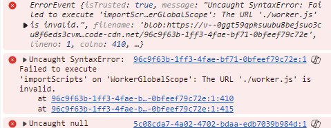

# Worker thread Extension

It is a simple demonstration of creating a basic web extension using worker
thread module.

## Conclusion

Couldn't find a solution. Need to look into the code to get an
understanding of how they are using this in continue code.

